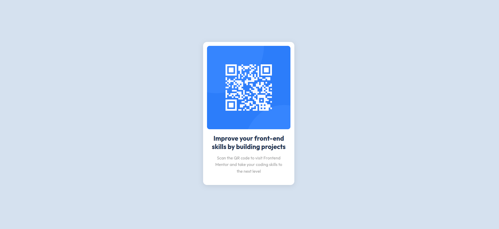

# Frontend Mentor - QR Code Component Solution

This is my solution to the Frontend Mentor QR Code Component challenge. The goal of this challenge was to create a responsive QR code card using HTML and CSS. I used **CSS Flexbox** to align and style the component.

## Table of Contents

-   [Overview](#overview)
-   [Screenshot](#screenshot)
-   [Features](#features)
-   [Technologies Used](#technologies-used)
-   [Setup Instructions](#setup-instructions)
-   [Acknowledgments](#acknowledgments)

----------

## Overview

This project replicates a QR code component that displays a QR code and text information in a centered, responsive card. It adapts seamlessly between desktop and mobile devices.

## Screenshot

### Mobile View 

### Desktop View 

----------

## Features

-   **Responsive Design**: Adjusts seamlessly between mobile and desktop screens.
-   **Flexbox Layout**: Used for centering and aligning elements.
-   Clean and modern UI with rounded corners and subtle shadow effects.

----------

## Technologies Used

-   **HTML5**: Markup structure.
-   **CSS3**: Styling, responsiveness, and layout (using Flexbox).

----------

## Setup Instructions

1.  Clone the repository:
    
    bash
    
    Copy code
    
    `git clone https://github.com/savalaram-redkar/frontend-mentor-qr-code-component.git` 
    
2.  Navigate to the project folder:
    
    bash
    
    Copy code
    
    `cd frontend-mentor-qr-code-component` 
    
3.  Open `index.html` in your browser to view the project.

----------

## Acknowledgments

-   Challenge provided by [Frontend Mentor](https://www.frontendmentor.io/).
-   Design inspiration and assets provided by Frontend Mentor.

Feel free to reach out with any feedback or suggestions for improvement!

----------

### Future Improvements

1.  Add animations or hover effects for an enhanced user experience.
2.  Explore additional layout techniques like **CSS Grid**.

----------

### Live Preview

[View Live Site](https://savalaram-redkar.github.io/frontend-mentor-qr-code-component/)  

----------

**Author**: Savalaram Redkar  
Feel free to connect on [LinkedIn](https://www.linkedin.com/in/savalaram-redkar). 